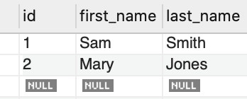

# api-test

This is the project to use various ways to retrieve some data from a mysql database

## sql-syntax

MySQL database was set up and retrieved data from pre-inserted records

## JDBC

The project has also used jdbc api to retrieve data from MySQL

## Rest API with spring boot

To simplify the process of setup, the rest api was designed using spring boot framework. I used
[spring initializer](http://start.spring.io/) to deploy mysql-connector, jpa, and spring web
